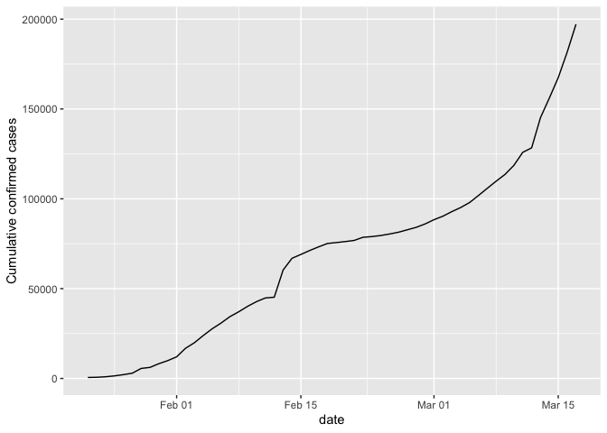
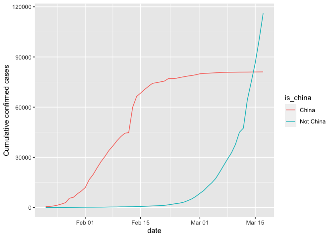
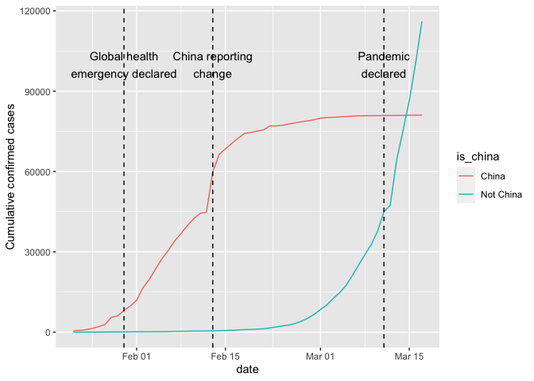
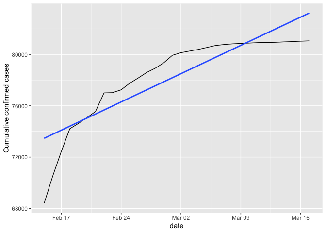
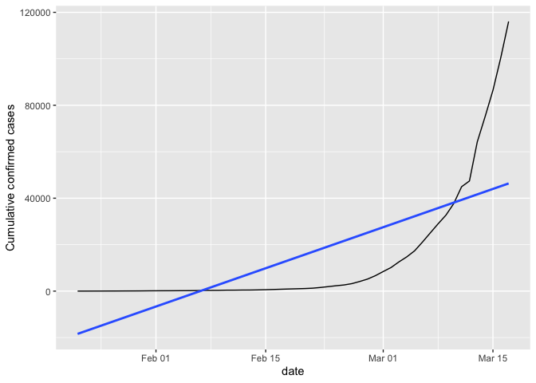
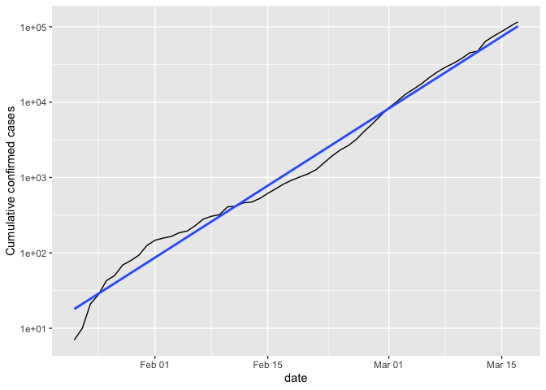
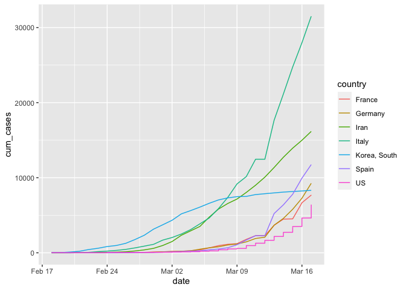

covid_pandemic
================
Youn-Jeong Choi
2023-09-05

This is an R Markdown document.

### 1. Worldwide confirmed cases were visualized over time: Read the worldwide confirmed cases data and make a plot.

``` r
# Read confirmed_cases_worldwide.csv into confirmed_cases_worldwide
confirmed_cases_worldwide <- read_csv("data/confirmed_cases_worldwide.csv")
```

    ## Rows: 56 Columns: 2
    ## ── Column specification ────────────────────────────────────────────────────────
    ## Delimiter: ","
    ## dbl  (1): cum_cases
    ## date (1): date
    ## 
    ## ℹ Use `spec()` to retrieve the full column specification for this data.
    ## ℹ Specify the column types or set `show_col_types = FALSE` to quiet this message.

``` r
# See the result
confirmed_cases_worldwide
```

    ## # A tibble: 56 × 2
    ##    date       cum_cases
    ##    <date>         <dbl>
    ##  1 2020-01-22       555
    ##  2 2020-01-23       653
    ##  3 2020-01-24       941
    ##  4 2020-01-25      1434
    ##  5 2020-01-26      2118
    ##  6 2020-01-27      2927
    ##  7 2020-01-28      5578
    ##  8 2020-01-29      6166
    ##  9 2020-01-30      8234
    ## 10 2020-01-31      9927
    ## # ℹ 46 more rows

``` r
# Draw a line plot of cumulative cases vs. date
# Label the y-axis
ggplot(confirmed_cases_worldwide, aes(date, cum_cases)) +
  geom_line() +
  ylab("Cumulative confirmed cases")
```

<!-- -->

### 2. China was compared to the rest of the world: Read and visualize confirmed data between China vs non-China

``` r
# Read in datasets/confirmed_cases_china_vs_world.csv
confirmed_cases_china_vs_world <- read_csv("data/confirmed_cases_china_vs_world.csv")
```

    ## Rows: 112 Columns: 4
    ## ── Column specification ────────────────────────────────────────────────────────
    ## Delimiter: ","
    ## chr  (1): is_china
    ## dbl  (2): cases, cum_cases
    ## date (1): date
    ## 
    ## ℹ Use `spec()` to retrieve the full column specification for this data.
    ## ℹ Specify the column types or set `show_col_types = FALSE` to quiet this message.

``` r
# See the result
glimpse(confirmed_cases_china_vs_world)
```

    ## Rows: 112
    ## Columns: 4
    ## $ is_china  <chr> "China", "China", "China", "China", "China", "China", "China…
    ## $ date      <date> 2020-01-22, 2020-01-23, 2020-01-24, 2020-01-25, 2020-01-26,…
    ## $ cases     <dbl> 548, 95, 277, 486, 669, 802, 2632, 578, 2054, 1661, 2089, 47…
    ## $ cum_cases <dbl> 548, 643, 920, 1406, 2075, 2877, 5509, 6087, 8141, 9802, 118…

``` r
# Draw a line plot of cumulative cases vs. date, colored by is_china
# Define aesthetics within the line geom
plt_cum_confirmed_cases_china_vs_world <- ggplot(confirmed_cases_china_vs_world) +
  geom_line(aes(date, cum_cases, color = is_china)) +
  ylab("Cumulative confirmed cases")

# See the plot
plt_cum_confirmed_cases_china_vs_world
```

<!-- -->

### 3. Let’s annotate!

We can better understand the curves by annotation.

``` r
who_events <- tribble(
  ~ date, ~ event,
  "2020-01-30", "Global health\nemergency declared",
  "2020-03-11", "Pandemic\ndeclared",
  "2020-02-13", "China reporting\nchange"
) %>%
  mutate(date = as.Date(date))

# Using who_events, add vertical dashed lines with an xintercept at date
# and text at date, labeled by event, and at 100000 on the y-axis
plt_cum_confirmed_cases_china_vs_world +
  geom_vline(data = who_events, aes(xintercept = date), linetype = 2) + geom_text(data = who_events, aes(date, 100000, label = event)) 
```

<!-- -->

### 4.Let’s add a trend line for China

``` r
# Filter for China, from Feb 15
china_after_feb15 <- confirmed_cases_china_vs_world %>%
  filter(date >= "2020-02-15", is_china == "China")

# Using china_after_feb15, draw a line plot cum_cases vs. date
# Add a smooth trend line using linear regression, no error bars
china_after_feb15 %>% ggplot(aes(date, cum_cases)) +
  geom_line() +
  geom_smooth(method = "lm", formula = y~x, se = FALSE) +
  ylab("Cumulative confirmed cases")
```

<!-- -->

### 5. Then add a trend line to the rest of world.

    How about the other countries instead of China?  

``` r
# Filter confirmed_cases_china_vs_world for not China
not_china <- confirmed_cases_china_vs_world %>%
filter(is_china == "Not China")

# Using not_china, draw a line plot cum_cases vs. date
# Add a smooth trend line using linear regression, no error bars
plt_not_china_trend_lin <- not_china %>% ggplot(aes(date, cum_cases)) +
  geom_line() +
  geom_smooth(method = "lm", formula =y~x, se = FALSE) +
  ylab("Cumulative confirmed cases")
plt_not_china_trend_lin
```

<!-- -->

``` r
# Modify the plot to use a logarithmic scale on the y-axis
plt_not_china_trend_lin + scale_y_log10()
```

<!-- -->

### 6. Which countries outside of China have been stricken hard by covid-19?

``` r
# Run this to get the data for each country
confirmed_cases_by_country <- read_csv("data/confirmed_cases_by_country.csv")
```

    ## Rows: 13272 Columns: 5
    ## ── Column specification ────────────────────────────────────────────────────────
    ## Delimiter: ","
    ## chr  (2): country, province
    ## dbl  (2): cases, cum_cases
    ## date (1): date
    ## 
    ## ℹ Use `spec()` to retrieve the full column specification for this data.
    ## ℹ Specify the column types or set `show_col_types = FALSE` to quiet this message.

``` r
glimpse(confirmed_cases_by_country)
```

    ## Rows: 13,272
    ## Columns: 5
    ## $ country   <chr> "Afghanistan", "Albania", "Algeria", "Andorra", "Antigua and…
    ## $ province  <chr> NA, NA, NA, NA, NA, NA, NA, NA, NA, NA, NA, NA, NA, NA, NA, …
    ## $ date      <date> 2020-01-22, 2020-01-22, 2020-01-22, 2020-01-22, 2020-01-22,…
    ## $ cases     <dbl> 0, 0, 0, 0, 0, 0, 0, 0, 0, 0, 0, 0, 0, 0, 0, 0, 0, 0, 0, 0, …
    ## $ cum_cases <dbl> 0, 0, 0, 0, 0, 0, 0, 0, 0, 0, 0, 0, 0, 0, 0, 0, 0, 0, 0, 0, …

``` r
# Group by country, summarize to calculate total cases, find the top 7
top_countries_by_total_cases <- confirmed_cases_by_country %>%
  group_by(country) %>%
  summarize(total_cases = sum(cases)) %>%
  top_n(7)
```

    ## Selecting by total_cases

``` r
# See the result
top_countries_by_total_cases
```

    ## # A tibble: 7 × 2
    ##   country      total_cases
    ##   <chr>              <dbl>
    ## 1 France              7699
    ## 2 Germany             9257
    ## 3 Iran               16169
    ## 4 Italy              31506
    ## 5 Korea, South        8320
    ## 6 Spain              11748
    ## 7 US                  6421

### 7. Let’s plot the top 7 the most stricken countries outside of China over time.

``` r
# Read in the dataset from datasets/confirmed_cases_top7_outside_china.csv
confirmed_cases_top7_outside_china <- read_csv("data/confirmed_cases_top7_outside_china.csv")
```

    ## Rows: 2030 Columns: 3
    ## ── Column specification ────────────────────────────────────────────────────────
    ## Delimiter: ","
    ## chr  (1): country
    ## dbl  (1): cum_cases
    ## date (1): date
    ## 
    ## ℹ Use `spec()` to retrieve the full column specification for this data.
    ## ℹ Specify the column types or set `show_col_types = FALSE` to quiet this message.

``` r
# Glimpse at the contents of confirmed_cases_top7_outside_china
glimpse(confirmed_cases_top7_outside_china)
```

    ## Rows: 2,030
    ## Columns: 3
    ## $ country   <chr> "Germany", "Iran", "Italy", "Korea, South", "Spain", "US", "…
    ## $ date      <date> 2020-02-18, 2020-02-18, 2020-02-18, 2020-02-18, 2020-02-18,…
    ## $ cum_cases <dbl> 16, 0, 3, 31, 2, 13, 13, 13, 13, 13, 13, 13, 13, 13, 13, 13,…

``` r
# Using confirmed_cases_top7_outside_china, draw a line plot of
# cum_cases vs. date, colored by country
confirmed_cases_top7_outside_china %>% 
ggplot(aes(date, cum_cases, color = country)) +
geom_line()
```

<!-- -->
